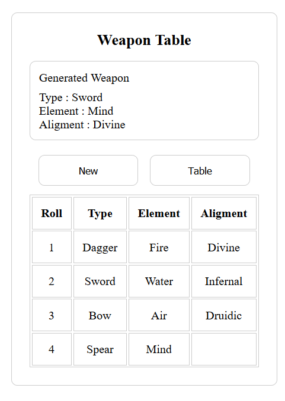

# Advanced Rpg Table

A simple embeddable table and random generator.

## Usage

In your html:

Before you write the table you have to link to this script, this might be in the head of the site but not necessarily.

```
<script src="https://unpkg.com/advanced-rpg-table" type="module"></script>
```

Afterwards in your html just add the advanced table, being careful with the form of the text within the tag.

```
  <advanced-table subject="weapon">
    {
      "type": ["dagger", "sword", "bow", "spear"],
      "element": ["fire", "water", "air", "mind"],
      "aligment": ["divine","infernal","druidic"]
    }
  </advanced-table>
```
This should generate:




If the text within doesn't respect this form (it should be a JSON object) the table will not be generated correctly.

Another example of a possible configuration:

```
  <advanced-table subject="ship">
    {
      "designation": ["scout", "trader", "warship", "colony ship", "science ship"],
      "weapons": ["laser", "plasma", "mass driver"],
      "engine": ["warp drive","hyper drive", "jump drive"],
      "captain": ["rookie", "veteran", "diplomat", "pirate"]
    }
  </advanced-table>
```
## Previous versions

Versions with 1.x.x required you to define the config in js then pass it to the tag, with 2.0.0 this has changed and it is a breaking change, the old code will remain on npm but if someone is using it I would advise to go to the latest version.
